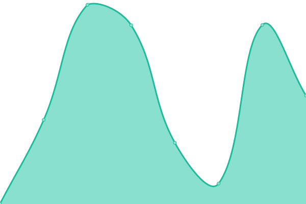

# [📈 Live Status](https://uptime.pathwar.land): <!--live status--> **🟧 Partial outage**

This repository contains the open-source uptime monitor and status page for [Pathwar](https://pathwar.land/), powered by [Upptime](https://github.com/upptime/upptime).

With [Upptime](https://upptime.js.org), you can get your own unlimited and free uptime monitor and status page, powered entirely by a GitHub repository. We use [Issues](https://github.com/pathwar/uptime/issues) as incident reports, [Actions](https://github.com/pathwar/uptime/actions) as uptime monitors, and [Pages](https://uptime.pathwar.land) for the status page.

<!--start: status pages-->
<!-- This summary is generated by Upptime (https://github.com/upptime/upptime) -->
<!-- Do not edit this manually, your changes will be overwritten -->
<!-- prettier-ignore -->
| URL | Status | History | Response Time | Uptime |
| --- | ------ | ------- | ------------- | ------ |
|  [pathwar.land](https://pathwar.land) | 🟩 Up | [pathwar-land.yml](https://github.com/pathwar/uptime/commits/HEAD/history/pathwar-land.yml) | 

 827ms
     
 | 

<a href="https://uptime.pathwar.land/history/pathwar-land">99.94%</a>
    

|  [api.pathwar.land](https://api.pathwar.land/status) | 🟥 Down | [api-pathwar-land.yml](https://github.com/pathwar/uptime/commits/HEAD/history/api-pathwar-land.yml) | 

 0ms
     
 | 

<a href="https://uptime.pathwar.land/history/api-pathwar-land">0.00%</a>
    

|  [id.pathwar.land](https://id.pathwar.land) | 🟥 Down | [id-pathwar-land.yml](https://github.com/pathwar/uptime/commits/HEAD/history/id-pathwar-land.yml) | 

 394ms
     
 | 

<a href="https://uptime.pathwar.land/history/id-pathwar-land">0.00%</a>
    

|  [api-dev.pathwar.land](https://api-dev.pathwar.land/status) | 🟥 Down | [api-dev-pathwar-land.yml](https://github.com/pathwar/uptime/commits/HEAD/history/api-dev-pathwar-land.yml) | 

 618ms
     
 | 

<a href="https://uptime.pathwar.land/history/api-dev-pathwar-land">0.00%</a>
    

|  [assets.pathwar.land](https://assets.pathwar.land) | 🟩 Up | [assets-pathwar-land.yml](https://github.com/pathwar/uptime/commits/HEAD/history/assets-pathwar-land.yml) | 

 426ms
     
 | 

<a href="https://uptime.pathwar.land/history/assets-pathwar-land">99.95%</a>
    

|  [fr1.pathwar.net](fr1.pathwar.net) | 🟩 Up | [fr1-pathwar-net.yml](https://github.com/pathwar/uptime/commits/HEAD/history/fr1-pathwar-net.yml) | 

 111ms
     
 | 

<a href="https://uptime.pathwar.land/history/fr1-pathwar-net">100.00%</a>
    

|  [fr2.pathwar.net](fr2.pathwar.net) | 🟩 Up | [fr2-pathwar-net.yml](https://github.com/pathwar/uptime/commits/HEAD/history/fr2-pathwar-net.yml) | 

 111ms
     
 | 

<a href="https://uptime.pathwar.land/history/fr2-pathwar-net">100.00%</a>
    

<!--end: status pages-->

[**Visit our status website →**](https://uptime.pathwar.land)

## 📄 License

- Powered by: [Upptime](https://github.com/upptime/upptime)
- Code: [MIT](./LICENSE) © [Pathwar](https://pathwar.land/)
- Data in the `./history` directory: [Open Database License](https://opendatacommons.org/licenses/odbl/1-0/)
